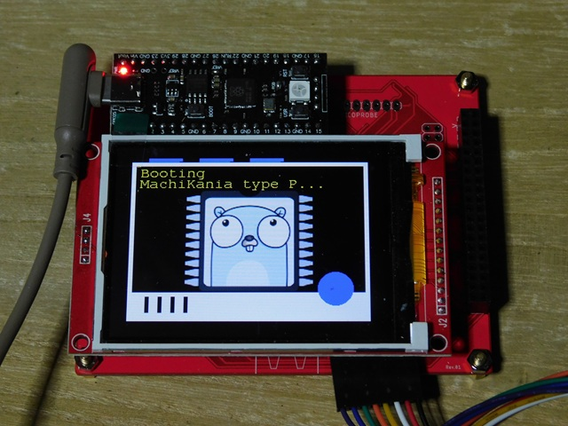
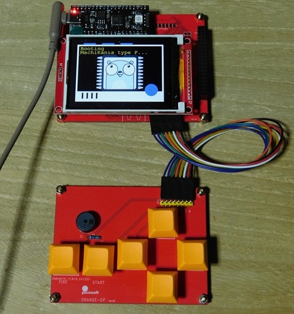

# MachiKania-TinyGo

Raspberry Pi Picoを利用してBASICプログラムを動作させることができるオープンプラットフォーム[MachiKania](https://github.com/machikania)の中の液晶搭載モデル [type P](http://www.ze.em-net.ne.jp/~kenken/machikania/typep.html) を[TinyGo](https://tinygo.org/)で動かしてみました。  

使用したMachiKania type P のスペックは以下の通りです。  

* 液晶	ILI9341搭載QVGA（320x240）SPI接続
* キー	上下左右、FIRE、START用計6個
* ブザー	圧電スピーカ 1

### 液晶

液晶は、SPI1に接続されており、標準的なili9341液晶ドライバで動きました。  



以下が、設定とピンの割当です。  

| 項目 | 内容 |
|:-----|:-----|
| 液晶ドライバ | ili9341 |
| Raspiと液晶の接続 | SPI1 に接続 |
| 周波数設定 | 32000000 Hz |

| PIN    | 機能割当て |
|:-----|:-----|
| GPIO12 | SDI:Default Serial In Bus |
| GPIO15 | SDO:Default Serial Out Bus   1 for SPI communications MOSI |
| GPIO14 | SCK:Default Serial Clock Bus 1 for SPI communications SCLK |
| GPIO10 | LCD_DC |
| GPIO13 | LCD_CS |
| GPIO11 | LCD_RESET |

### キーとブザー



キーパッドの設定

| PIN    | キー   |
|:-------|:------ |
| GPIO4  | up     |
| GPIO5  | left   |
| GPIO6  | down   |
| GPIO7  | right  |
| GPIO27 | A      |
| GPIO28 | B      |

ブザーの設定

| PIN    | 機能         |
|:-------|:------------ |
| GPIO28 | PIEZO BUZZER |


## サンプルプログラム

### 使い方

以下のコマンドで、このサイトの内容をローカルドライブにコピーして下さい。  

```bash
git clone https://github.com/triring/MachiKania-TinyGo.git
```

サンプルプログラムを収めたそれぞれのディレクトリには、README.mdファイルがあるので、これを読んでから、サンプルを実行して下さい。  

まだtinygoの開発環境を用意していない方へ  

	サンプルプログラムを収めたそれぞれのディレクトリには、コンパイル済みのuf2ファイルがあります。
	MachiKaniaを書込みモードに切り替えて、マウントされた[RPI-RP2]ドライブにこのuf2ファイルをコピーして下さい。

### L-chika

Raspberry Pi Pico上のLEDを点滅させます。  
[./L-chika/README.md](./L-chika/README.md)

### buzzer

MachiKania のブザーを鳴らします。  
[./buzzer/README.md](./buzzer/README.md)

### SixKeyPad

MachiKania のキー入力をテストします。  
[./SixKeyPad/README.md](./SixKeyPad/README.md)

### dispJPG

jpeg形式の画像データを液晶に表示します。  
[./dispJPG/README.md](./dispJPG/README.md)

### dispPNG

png形式の画像データを液晶に表示します。  
[./dispPNG/README.md](./dispPNG/README.md)

## 参考文献

* [基礎から学ぶ TinyGoの組込み開発](https://c-r.com/book/detail/1477)
* [tinygo-keeb/workshop](https://github.com/tinygo-keeb/workshop)