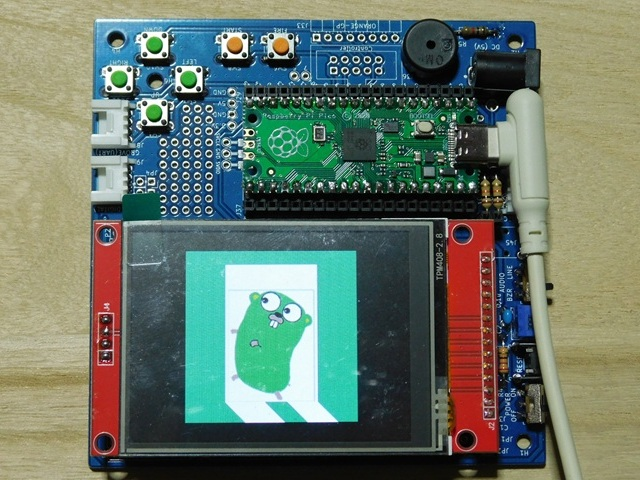

# dispPNG

png形式の画像データを液晶に表示します。



## コンパイルと書き込み

1. 必要に応じて、以下のパッケージを追加インストールして下さい。すでにインストールされている場合は、不要です。  

```bash
go get tinygo.org/x/drivers/ili9341
go get tinygo.org/x/tinyfont
go get tinygo.org/x/tinyfont/freemono
```

2. 以下のコマンドを実行してください。  

```bash
> tinygo build -o dispPNG.uf2 --target=pico --size short .
   code    data     bss |   flash     ram
 116136    5008    3376 |  121144    8384
```

3. dispPNG.uf2 というファイルが生成されます。  
以下の手順で、このファイルをRaspberry Pi Picoに書き込んでください。

    1. Bootボタンを押しながらRaspberry Pi PicoにUSB給電すると[RPI-RP2]ドライブがマウントされ、書込みモードになります。  
    Pico互換ボードでは、Bootボタンを押した状態で、Resetボタンを押すと書込みモードになります。
    2. 先ほど作成した uf2ファイルを[RPI-RP2]ドライブにコピーします。  
    正常に書き込みができると強制アンマウントされ、プログラムがスタートします。


また、以下のコマンドを実行すると、コンパイル終了後に、直接、Raspberry Pi Picoに書込みをしてくれます。

```bash
> tinygo flash --target=pico --size short .
   code    data     bss |   flash     ram
 107696    2944    5496 |  110640    8440
```

## 画像ファイルについて

表示しているpng画像は、[graphics.go](graphics.go)内にテキストデータとして埋め込んであります。  
他の画像ファイルを使用したい場合は、この部分のデータを書き換えて下さい。  
png画像からテキストデータへの変換は、image ディレクトリ内にある [image/BinToHexTxt.go](image/BinToHexTxt.go) を使用します。  
詳しい使い方は、[image/README.md](image/README.md)に書いてありますので、これを参照して下さい。  

[Parent Directory](../README.md)

